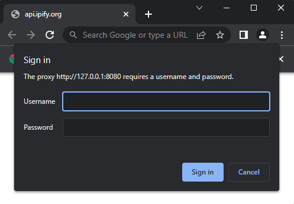

# Network

## Proxy

You can set a browser instance to use use a proxy server.
For that you must launch a browser with a `--proxy-server` argument.

> **NOTE**: Single browser can only use a single proxy. If you need to use multiple
> proxies you will have to create multiple browser connections.

An important bit to make proxy actually work is that you must handle
authentication pop-up that chromium presents to the user:



go-rod makes it easy to handle this pop-up using `browser.MustHandleAuth()` function:

```go
// Handle proxy authentication pop-up
go browser.MustHandleAuth("user", "password")()
```

Notice how `browser.MustHandleAuth()` returns a **function** that you must call as
a goroutine. This makes sure your program can execute normally while handling
authentication pop-ups asynchronously.

---

You can use [mitmproxy](https://mitmproxy.org/) in order to test if your code
works with a proxy:

```bash
docker run --rm -it -p 8080:8080 mitmproxy/mitmproxy mitmdump -p 8080 --proxyauth user:password
```

Once you have proxy started, launch a browser and load a page through the proxy.

Below is a complete example on how to do this:

```go
// Create a browser launcher
l := launcher.New()
// Pass '--proxy-server=127.0.0.1:8081' argument to the browser on launch
l = l.Set(flags.ProxyServer, "127.0.0.1:8080")
// Launch the browser and get debug URL
controlURL, _ := l.Launch()

// Connect to the newly launched browser
browser := rod.New().ControlURL(controlURL).MustConnect()

// Handle proxy authentication pop-up
go browser.MustHandleAuth("user", "password")() // <-- Notice how HandleAuth returns
                                                //     a function that must be
                                                //     started as a goroutine!

// Ignore certificate errors since we are using local insecure proxy
browser.MustIgnoreCertErrors(true)

// Navigate to the page that prints IP address
page := browser.MustPage("http://api.ipify.org")

// IP address should be the same, since we are using local
// proxy, however the response signals that the proxy works
println(page.MustElement("html").MustText())
```

## Cookies

The `rod.Browser` and `rod.Page` both has several helper methods for setting or getting cookies.

## Hijack requests

You can use Rod to hijack any HTTP or HTTPS traffic.

> Beware that hijacking requests is not a replacement for proxy. If you try to
> use hijacking instead of proxy you will get issues with HTTP headers.
> While it is possible to rewrite hijacked **HTTP** request headers and use
> proxy with those, it seems that currently it is impossible to do so for
> **HTTPS** requests. If you need to proxy requests
> [use MustHandleAuth instead](/network?id=proxy).

The entire process of hijacking one request:

```text
browser --req-> rod ---> server ---> rod --res-> browser
```

When the browser wants to send a request to a server, it will send the request to Rod first, then Rod will act like
a proxy to send the request to the actual server and return the response to the browser.
The `--req->` and `--res->` are the parts that can be modified.

For example, to replace a file `test.js` response from the server we can do something like this:

```go
browser := rod.New().MustConnect()

router := browser.HijackRequests()

router.MustAdd("*/test.js", func(ctx *rod.Hijack) {
    ctx.MustLoadResponse()
    ctx.Response.SetBody(`console.log("js file replaced")`)
})

go router.Run()

page := browser.MustPage("https://test.com/")

// Hijack requests under the scope of a page
page.HijackRequests()
```

For more info check the [hijack tests](https://github.com/go-rod/rod/blob/main/hijack_test.go)

## Throttling

You can throttle the network to simulate and test the slow network effect on your tests:

```go
page.EnableDomain(proto.NetworkEnable{})

_ = proto.NetworkEmulateNetworkConditions{
    Offline:            false,
    Latency:            300,
    DownloadThroughput: 100,
    UploadThroughput:   50,
    ConnectionType:     proto.NetworkConnectionTypeCellular2g,
}.Call(page)
```

## Blocking certain resources from loading

If needed, you can block certain resources (like images or fonts) from loading using the `Page.HijackRequests`.

This is useful if you want to improve page loading times, especially if you're running on Headless Mode,
since there is no point on loading fonts/css. Example below:

```go
func main() {
    page := rod.New().MustConnect().MustPage("")

    router := page.HijackRequests()

    router.MustAdd("*.png", func(ctx *rod.Hijack) {
        // There're a lot of types you can use in this enum, like NetworkResourceTypeScript for javascript files
        // In this case we're using NetworkResourceTypeImage to block images
        if ctx.Request.Type() == proto.NetworkResourceTypeImage {
            ctx.Response.Fail(proto.NetworkErrorReasonBlockedByClient)
            return
        }
        ctx.ContinueRequest(&proto.FetchContinueRequest{})
    })

    // since we are only hijacking a specific page, even using the "*" won't affect much of the performance
    go router.Run()

    page.MustNavigate("https://github.com/").MustWaitStable().MustScreenshot("")
}
```
